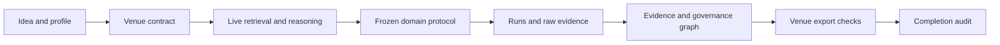

# Autoresearch Architecture

The normative behavior is defined by
`docs/specs/multidomain-top-venue-autoresearch.md`. This document describes the
implemented boundaries; it does not widen the supported capability level.

## Contract Layers

1. `profiles/` defines scientific expectations for five research domains.
2. `venues/` defines versioned venue-year-track policy contracts. Draft or
   stale contracts cannot certify an export.
3. `adapters/` isolates live LLM and scholarly-source I/O, budgets, raw-response
   hashes, and degradation status.
4. `pipeline/` owns stage transitions, gates, checkpoints, recovery, and stage
   artifact contracts.
5. `experiments/plugins/` validates global and domain-specific frozen protocol
   fields before evidence can be promoted.
6. `governance/` and `evidence/` validate rights/privacy status and connect raw
   artifacts to metrics and claims.
7. `paper/` composes global, domain, evidence, governance, and venue checks.
8. `audit/` is the only repository-wide MD-001..MD-015 completion verdict.

## Fail-Closed Flow

Every arrow carries identity and provenance. Unknown policy, synthetic
substitution, degraded retrieval, missing asset rights, invalid protocol,
orphan claims, and unmaterialized templates remain explicit blockers.

## Capability Boundary

A completed 12-stage run is an artifact workflow result, not a completion or
submission verdict. `quality_report.json`, `venue_export.json`, and
`docs/audits/multidomain-completion.json` are separate gates. The repository
goal is complete only when `audit-completion` returns zero.
