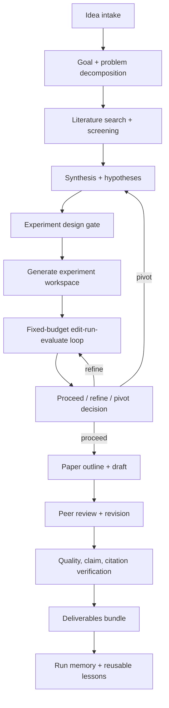
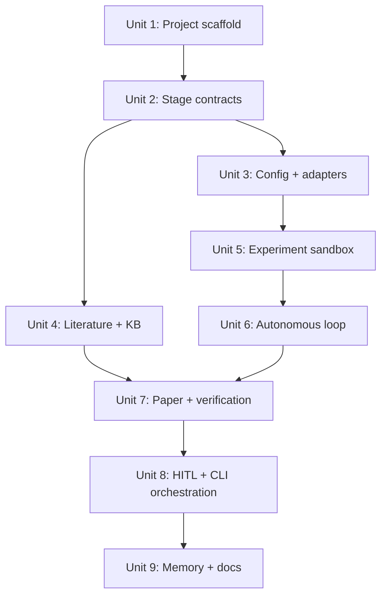
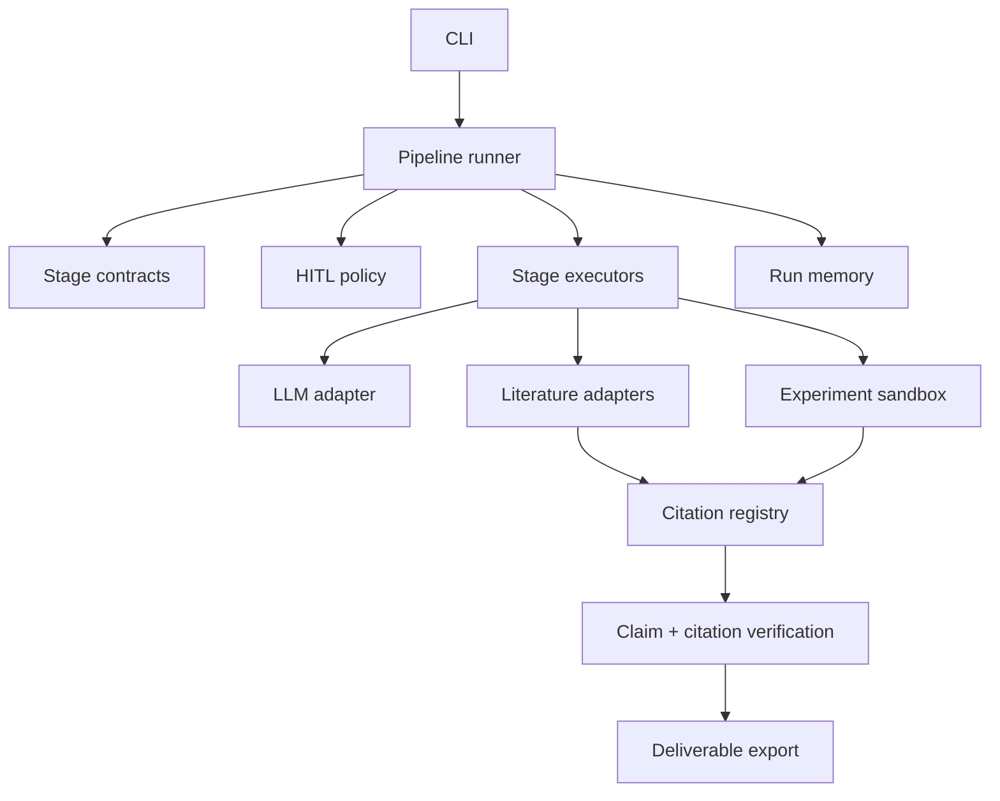

# feat: Build local idea-to-paper autoresearch workflow

## Overview

Build a local autonomous research workflow that turns a user idea into a reproducible, review-ready academic paper package. The design merges the useful ideas from `karpathy/autoresearch` and `aiming-lab/AutoResearchClaw` without copying either project wholesale:

- From `karpathy/autoresearch`: small editable research surface, fixed-budget experiment loop, metric ledger, keep/discard discipline, and a human-maintained "research org" prompt.
- From `AutoResearchClaw`: stage contracts, literature collection, HITL gates, sandboxed experiment execution, pivot/refine decisions, paper drafting, quality gates, citation verification, deliverable export, and run memory.

The target is not to promise top-conference acceptance. The target is a local workflow that can produce a credible top-conference submission candidate: grounded literature, falsifiable hypothesis, real experiments, reproducible artifacts, verified references, review responses, and conference-ready LaTeX.

## Implementation Status (2026-06-18)

The repository now has an executable 12-stage scaffold with contracts,
checkpoints, seed literature, local toy experiments, citation and numeric-claim
verification, paper export, an ML-systems domain profile, a stage-aware skill
harness, profile/depth quality checks, a pre-run alignment manifest, structured
literature-gap/hypothesis/empirical-claim records, provenance-rich experiment
ledgers, immutable-evaluator enforcement, protocol fingerprints, and a hashed
artifact manifest. The scaffold is tested but is not yet a real venue-ready
idea-to-paper system: provider adapters, live scholarly retrieval, saturated
claim-scoped novelty search, real generated experiments, statistical evidence,
SmartPause and advanced HITL modes, and durable memory remain open. The local
CLI now supports auditable approve/reject decisions, checkpoint resume with
config identity validation, rejection rollback, and completed-bundle export.

The normative domain and harness contract is
`docs/specs/research-alignment.md`. Numeric depth floors are local operating
defaults, not conference requirements.

## Problem Frame

The user wants a local setup where they can start from an idea and drive toward a paper strong enough for top venues. At plan creation on 2026-06-15, the project directory had no implementation files, so this began as a greenfield implementation plan.

The core engineering problem is to avoid building a giant opaque agent script. The workflow should make each stage inspectable, resumable, testable, and falsifiable. The autonomous parts should iterate aggressively, but high-leverage choices such as literature scope, experiment design, pivot decisions, and final quality should be guarded by approval gates or confidence-based pauses.

## Requirements Trace

- R1. Accept a raw research idea and turn it into a structured project goal with scope, constraints, target venue family, and success metrics.
- R2. Collect real literature from first-party or reputable scholarly APIs and preserve provenance for every cited source.
- R3. Produce falsifiable hypotheses and experiment plans with baselines, ablations, metrics, and resource budgets.
- R4. Execute real experiments locally first, with optional Docker or remote GPU backends later.
- R5. Run an autonomous fixed-budget edit-run-evaluate loop and keep only changes that improve the configured metric or simplify the code without quality loss.
- R6. Maintain stage contracts, checkpoints, artifacts, and a machine-readable run ledger so runs are resumable and auditable.
- R7. Add HITL gates for literature screening, experiment design, research decision, and final paper quality.
- R8. Draft, review, revise, and export a paper package with LaTeX, BibTeX, figures, experiment code, and verification reports.
- R9. Verify citations and numerical claims against collected sources and experiment outputs before export.
- R10. Preserve run learnings in a local memory store so future runs can reuse failures, decisions, and prompt improvements.

## Scope Boundaries

- Initial scope is a local Python CLI and library, not a hosted SaaS or web dashboard.
- Initial experiment execution is local subprocess sandbox plus an interface for Docker/SSH later; full multi-domain specialist agents are deferred.
- The workflow may integrate external LLM APIs or CLI agents, but provider-specific code must sit behind adapter interfaces.
- The implementation should reimplement patterns and cite sources; it should not paste large upstream code blocks without an explicit licensing review.
- "Top conference" is treated as a quality target and review rubric, not a guaranteed outcome.
- The first production-worthy domain should be machine learning systems or empirical ML, because it matches the Karpathy experiment-loop prior and is easiest to validate locally.

## Context & Research

### Relevant Code and Patterns

- Local project at plan creation: empty except `.omx` runtime state. Current implementation follows the source layout and contracts recorded in the implementation status above.
- `karpathy/autoresearch` uses only a few core files: `prepare.py`, `train.py`, and `program.md`. Its key pattern is a constrained autonomous loop where the agent only edits `train.py`, runs a fixed 5-minute training budget, records `val_bpb`, and keeps or discards each commit.
- `AutoResearchClaw` uses `researchclaw/pipeline/stages.py` for 23 stages, `researchclaw/pipeline/contracts.py` for per-stage input/output contracts, `researchclaw/pipeline/runner.py` for checkpointed orchestration, `researchclaw/pipeline/executor.py` plus `researchclaw/pipeline/stage_impls/` for stage execution, `researchclaw/experiment/factory.py` for sandbox backend selection, and `researchclaw/hitl/smart_pause.py` for confidence-driven intervention.
- `AutoResearchClaw` also has broad test coverage under `tests/`, with focused files for CLI, config, runner, contracts, sandboxes, HITL, literature, paper verification, citation verification, and templates.

### Institutional Learnings

- No `docs/solutions/` or prior local requirements documents exist yet.

### External References

- [karpathy/autoresearch](https://github.com/karpathy/autoresearch)
- [karpathy/autoresearch README](https://github.com/karpathy/autoresearch/blob/master/README.md)
- [karpathy/autoresearch program.md](https://github.com/karpathy/autoresearch/blob/master/program.md)
- [aiming-lab/AutoResearchClaw](https://github.com/aiming-lab/AutoResearchClaw)
- [AutoResearchClaw README](https://github.com/aiming-lab/AutoResearchClaw/blob/main/README.md)
- [AutoResearchClaw RESEARCHCLAW_AGENTS.md](https://github.com/aiming-lab/AutoResearchClaw/blob/main/RESEARCHCLAW_AGENTS.md)
- [AutoResearchClaw config example](https://github.com/aiming-lab/AutoResearchClaw/blob/main/config.researchclaw.example.yaml)
- [AutoResearchClaw HITL guide](https://github.com/aiming-lab/AutoResearchClaw/blob/main/docs/HITL_GUIDE.md)

## Key Technical Decisions

- Build the local project as a Python 3.11+ package with a CLI entry point: matches both upstream repos and keeps experiment execution, literature APIs, and LaTeX tooling straightforward.
- Use a stage-contract architecture instead of a single agent prompt: contracts make artifacts, resumption, testing, and review possible.
- Start with a 12-stage local MVP instead of copying AutoResearchClaw's full 23-stage graph: preserves the end-to-end path while reducing first-version complexity.
- Make experiment-loop discipline a first-class subsystem: Karpathy's fixed-budget keep/discard loop is the most directly useful mechanism for actual discovery.
- Treat citations and numerical claims as verified registries: generated prose must be constrained by collected literature and experiment outputs.
- Keep HITL mandatory for high-leverage gates in the first version: fully autonomous mode can exist, but it should not be the default for publish-targeted runs.
- Use adapters for LLM, literature sources, sandbox backends, and export targets: provider and infrastructure choices should not leak into stage logic.

## Open Questions

### Resolved During Planning

- Should this be a direct fork of either upstream project? No. The local folder is empty and the user asked to merge ideas into a local workflow. A focused local package is lower risk and easier to own.
- Should the initial workflow optimize for full autonomy or publishable rigor? Publishable rigor. Autonomy should accelerate iteration, not bypass evidence gates.
- Should the first milestone implement all 23 AutoResearchClaw stages? No. A 12-stage MVP maps cleanly to the same lifecycle while keeping tests and operations tractable.

### Deferred to Implementation

- Exact LLM provider defaults: depends on available local credentials and model cost tolerance.
- Exact first benchmark task: should be chosen when running the first real project, based on available compute and target domain.
- Docker/SSH backend depth: local subprocess should land first; Docker and remote GPU can follow once contracts are stable.
- Conference template defaults: choose NeurIPS/ICLR/ICML after the first target domain is selected.

## High-Level Technical Design

> *This illustrates the intended approach and is directional guidance for review, not implementation specification. The implementing agent should treat it as context, not code to reproduce.*

## Implementation Units

- [ ] **Unit 1: Scaffold the local Python package**

**Goal:** Create the project skeleton for a maintainable local CLI/library.

**Requirements:** R1, R6

**Dependencies:** None

**Files:**
- Create: `pyproject.toml`
- Create: `README.md`
- Create: `src/autoresearch/__init__.py`
- Create: `src/autoresearch/cli.py`
- Create: `src/autoresearch/config.py`
- Create: `tests/conftest.py`
- Test: `tests/test_cli.py`
- Test: `tests/test_config.py`

**Approach:**
- Use `src/` layout and expose an `autoresearch` console script.
- Support commands for `init`, `run`, `status`, `resume`, `approve`, `reject`, and `export`.
- Keep config parseable as YAML, with environment-variable indirection for secrets.
- Add no heavy dependencies beyond what is needed for config, CLI output, HTTP calls, and tests.

**Patterns to follow:**
- `AutoResearchClaw` `pyproject.toml` for CLI packaging shape.
- `AutoResearchClaw` `config.researchclaw.example.yaml` for provider, runtime, experiment, and HITL grouping.

**Test scenarios:**
- Happy path: `autoresearch init` creates a config file from the example template without writing secrets.
- Happy path: config loading resolves environment variable names but does not print secret values.
- Edge case: missing required config field produces a precise validation error.
- Error path: invalid experiment mode fails before any stage starts.
- Integration: CLI `status` against a missing run directory reports "not found" without traceback.

**Verification:**
- Package imports cleanly.
- CLI help lists the expected commands.
- Config tests prove validation, defaults, and secret redaction.

- [ ] **Unit 2: Define stage contracts, artifacts, and checkpoints**

**Goal:** Build the workflow spine: stages, contracts, run directories, metadata, and resumable checkpoints.

**Requirements:** R1, R3, R6, R7

**Dependencies:** Unit 1

**Files:**
- Create: `src/autoresearch/pipeline/stages.py`
- Create: `src/autoresearch/pipeline/contracts.py`
- Create: `src/autoresearch/pipeline/artifacts.py`
- Create: `src/autoresearch/pipeline/checkpoint.py`
- Create: `src/autoresearch/pipeline/executor.py`
- Create: `src/autoresearch/pipeline/runner.py`
- Create: `src/autoresearch/pipeline/stage_impls/__init__.py`
- Create: `src/autoresearch/pipeline/stage_impls/core.py`
- Test: `tests/test_stages.py`
- Test: `tests/test_contracts.py`
- Test: `tests/test_checkpoint.py`
- Test: `tests/test_executor.py`
- Test: `tests/test_runner.py`

**Approach:**
- Start with 12 stages: idea intake, problem decomposition, literature collect, literature screen, synthesis, hypothesis generation, experiment design, experiment generation, experiment loop, result analysis and decision, paper draft and revision, final verification and export.
- Define input/output artifacts and definitions of done for every stage.
- Add a simple executor registry that dispatches each stage to a small implementation function.
- Write checkpoints atomically and resume from the next incomplete stage.
- Store each stage under `artifacts/<run_id>/stage-XX-<name>/`.
- Make gate stages explicit in stage metadata instead of burying them in executor code.

**Patterns to follow:**
- `AutoResearchClaw` `researchclaw/pipeline/stages.py`
- `AutoResearchClaw` `researchclaw/pipeline/contracts.py`
- `AutoResearchClaw` `researchclaw/pipeline/runner.py`

**Test scenarios:**
- Happy path: stages advance in numeric order and create expected stage directories.
- Happy path: checkpoint after stage 4 resumes at stage 5.
- Edge case: corrupt checkpoint is detected and requires explicit recovery.
- Error path: a stage that does not produce required outputs fails its contract.
- Integration: rejected experiment-design gate rolls back to hypothesis generation.

**Verification:**
- Contract tests cover every stage.
- Runner can execute a fake in-memory stage executor through a complete run.
- Checkpoints are atomic and never leave partial JSON on simulated write failure.

- [ ] **Unit 3: Add provider adapters and prompt program files**

**Goal:** Provide stable interfaces for LLMs, agent CLIs, prompts, and user-maintained research instructions.

**Requirements:** R1, R3, R6

**Dependencies:** Unit 1, Unit 2

**Files:**
- Create: `src/autoresearch/adapters/llm.py`
- Create: `src/autoresearch/adapters/agent_cli.py`
- Create: `src/autoresearch/prompts/manager.py`
- Create: `prompts/default.yaml`
- Create: `program.md`
- Create: `config/autoresearch.example.yaml`
- Test: `tests/test_llm_adapter.py`
- Test: `tests/test_agent_cli_adapter.py`
- Test: `tests/test_prompts.py`

**Approach:**
- Define a narrow LLM interface that supports chat completion, structured JSON requests, retries, and token/cost accounting.
- Add an optional local agent CLI adapter for tools such as Codex CLI or Claude Code, but do not require it for the first working path.
- Put stage prompts in `prompts/default.yaml`.
- Keep `program.md` as the human-editable "research organization" instruction file inspired by Karpathy's repo.
- Allow per-stage extra prompt files through config.

**Patterns to follow:**
- `karpathy/autoresearch` `program.md`
- `AutoResearchClaw` `prompts.default.yaml`
- `AutoResearchClaw` `researchclaw/llm/client.py`
- `AutoResearchClaw` `researchclaw/llm/acp_client.py`

**Test scenarios:**
- Happy path: prompt manager composes default prompt, program guidance, and stage-specific extra guidance in deterministic order.
- Happy path: fake LLM adapter returns structured JSON and records cost metadata.
- Edge case: malformed model JSON is retried and then surfaced with the raw response path.
- Error path: missing provider credentials fail before a paid call is attempted.
- Integration: a stage executor receives the same prompt context when resumed.

**Verification:**
- Provider-specific code is isolated behind adapters.
- Prompt fixtures make stage behavior testable without live LLM calls.

- [ ] **Unit 4: Implement literature collection, screening, and knowledge cards**

**Goal:** Ground the workflow in real papers and reusable structured knowledge before hypotheses are generated.

**Requirements:** R2, R3, R6, R9

**Dependencies:** Unit 2, Unit 3

**Files:**
- Create: `src/autoresearch/literature/models.py`
- Create: `src/autoresearch/literature/sources.py`
- Create: `src/autoresearch/literature/search.py`
- Create: `src/autoresearch/literature/screening.py`
- Create: `src/autoresearch/knowledge/cards.py`
- Create: `src/autoresearch/knowledge/store.py`
- Test: `tests/test_literature_sources.py`
- Test: `tests/test_literature_screening.py`
- Test: `tests/test_knowledge_cards.py`

**Approach:**
- Start with arXiv and Semantic Scholar/OpenAlex-style source interfaces; implementation can enable one source first and leave others as adapters.
- Persist raw candidate metadata as JSONL and screened papers as JSONL with score, reason, and provenance.
- Convert accepted papers into knowledge cards containing claim, method, dataset, metric, limitation, and citation metadata.
- Require every downstream citation to map back to a collected source or be marked unresolved.

**Patterns to follow:**
- `AutoResearchClaw` `researchclaw/literature/`
- `AutoResearchClaw` `researchclaw/knowledge/base.py`

**Test scenarios:**
- Happy path: search returns normalized paper records with title, authors, year, URL, source, and abstract.
- Happy path: screening keeps papers above threshold and records rejection reasons for others.
- Edge case: duplicate papers from two sources merge by DOI/arXiv ID/title similarity.
- Error path: source timeout records degraded status and continues if minimum papers are already collected.
- Integration: knowledge cards preserve citation keys used later by paper drafting.

**Verification:**
- Literature artifacts are deterministic in offline fixture tests.
- No paper can enter the shortlist without source provenance.

- [ ] **Unit 5: Build experiment workspace, validation, and sandbox execution**

**Goal:** Generate and run real experiment code in an isolated workspace with structured metrics.

**Requirements:** R3, R4, R6, R9

**Dependencies:** Unit 2, Unit 3

**Files:**
- Create: `src/autoresearch/experiments/spec.py`
- Create: `src/autoresearch/experiments/workspace.py`
- Create: `src/autoresearch/experiments/validator.py`
- Create: `src/autoresearch/experiments/sandbox.py`
- Create: `src/autoresearch/experiments/metrics.py`
- Create: `src/autoresearch/experiments/backends/base.py`
- Create: `src/autoresearch/experiments/backends/local.py`
- Test: `tests/test_experiment_spec.py`
- Test: `tests/test_experiment_validator.py`
- Test: `tests/test_local_sandbox.py`
- Test: `tests/test_metric_parser.py`

**Approach:**
- Represent experiment plans with baselines, ablations, metric keys, direction, time budget, and resource constraints.
- Generate an experiment workspace with code, config, expected outputs, and a README for reproducibility.
- Validate generated code before execution using a conservative AST/import policy and file boundary checks.
- Implement the local subprocess sandbox first behind a backend protocol; Docker and SSH should be contract-compatible follow-ups after the local backend is stable.
- Parse metrics from structured JSON outputs, not only logs.

**Patterns to follow:**
- `AutoResearchClaw` `researchclaw/experiment/factory.py`
- `AutoResearchClaw` `researchclaw/experiment/sandbox.py`
- `AutoResearchClaw` `researchclaw/experiment/docker_sandbox.py`
- `AutoResearchClaw` `researchclaw/experiment/validator.py`

**Test scenarios:**
- Happy path: a fixture experiment writes `metrics.json` and sandbox returns parsed metrics.
- Happy path: validator permits simple scientific Python imports configured as allowed.
- Edge case: experiment emits valid metrics but nonzero warnings; run is marked completed with warnings.
- Error path: forbidden file write outside workspace is rejected before execution.
- Error path: timeout kills the process and marks the run failed.
- Integration: stage contract requires `runs/` artifacts before result analysis can proceed.

**Verification:**
- Local sandbox tests run without external services.
- A malicious fixture cannot escape its workspace in validation tests.

- [ ] **Unit 6: Implement fixed-budget autonomous experiment loop**

**Goal:** Add the discovery engine: propose changes, run experiments, compare metrics, and keep/discard with a ledger.

**Requirements:** R4, R5, R6, R10

**Dependencies:** Unit 5

**Files:**
- Create: `src/autoresearch/experiments/loop.py`
- Create: `src/autoresearch/experiments/ledger.py`
- Create: `src/autoresearch/experiments/git_worktree.py`
- Create: `src/autoresearch/experiments/decision.py`
- Test: `tests/test_experiment_loop.py`
- Test: `tests/test_experiment_ledger.py`
- Test: `tests/test_experiment_decision.py`

**Approach:**
- Maintain a run ledger similar to Karpathy's `results.tsv`, but store JSONL plus an optional TSV export.
- Track idea, code diff summary, metric value, metric direction, resource usage, status, and keep/discard reason.
- Support a fixed per-trial wall-clock budget and maximum total iterations.
- Keep a change only when the primary metric improves, or when metric parity comes with a simpler implementation under an explicit simplification rule.
- Defer actual git commit/reset wiring until after a pure file-snapshot implementation works; the interface should allow git-backed worktrees later.

**Patterns to follow:**
- `karpathy/autoresearch` `program.md` experiment loop.
- `karpathy/autoresearch` fixed-time `train.py` run model.
- `AutoResearchClaw` `researchclaw/pipeline/stage_impls/_execution.py`
- `AutoResearchClaw` `researchclaw/pipeline/stage_impls/_analysis.py`

**Test scenarios:**
- Happy path: lower metric with `minimize` direction is kept and becomes new baseline.
- Happy path: higher metric with `maximize` direction is kept.
- Edge case: equal metric with lower complexity score is kept only when simplification mode is enabled.
- Error path: crashed run is logged and does not replace baseline.
- Error path: missing primary metric marks run invalid.
- Integration: refine decision loops back into another trial until max iterations or convergence.

**Verification:**
- Ledger is append-only.
- Decision policy tests cover minimize, maximize, crash, missing metric, and simplification.

- [ ] **Unit 7: Draft papers, verify claims, and export deliverables**

**Goal:** Produce a paper package constrained by collected literature and real experiment outputs.

**Requirements:** R8, R9

**Dependencies:** Unit 4, Unit 6

**Files:**
- Create: `src/autoresearch/paper/outline.py`
- Create: `src/autoresearch/paper/draft.py`
- Create: `src/autoresearch/paper/review.py`
- Create: `src/autoresearch/paper/revision.py`
- Create: `src/autoresearch/paper/claims.py`
- Create: `src/autoresearch/paper/citations.py`
- Create: `src/autoresearch/paper/export.py`
- Create: `src/autoresearch/templates/neurips.tex`
- Test: `tests/test_paper_outline.py`
- Test: `tests/test_claim_verification.py`
- Test: `tests/test_citation_verification.py`
- Test: `tests/test_export.py`

**Approach:**
- Generate outline before drafting and require every result claim to reference experiment evidence.
- Maintain a verified registry of numeric values from experiment summaries.
- Maintain a citation registry from screened literature and remove or flag unsupported citations.
- Export `paper.md`, `paper.tex`, `references.bib`, `figures/`, `experiment/`, `verification_report.json`, and `bundle_index.json`.
- Add a simulated multi-reviewer pass focused on novelty, method, experiments, clarity, and reproducibility.

**Patterns to follow:**
- `AutoResearchClaw` `researchclaw/pipeline/stage_impls/_paper_writing.py`
- `AutoResearchClaw` `researchclaw/pipeline/stage_impls/_review_publish.py`
- `AutoResearchClaw` `researchclaw/pipeline/verified_registry.py`
- `AutoResearchClaw` `researchclaw/templates/`

**Test scenarios:**
- Happy path: draft cites only keys present in the citation registry.
- Happy path: numeric claim matching experiment summary passes verification.
- Edge case: approximate numeric formatting still matches within configured tolerance.
- Error path: unsupported citation is removed or flagged in `verification_report.json`.
- Error path: fabricated numeric result in a table is replaced or blocks export.
- Integration: export bundle contains paper, BibTeX, figures, experiment code, run ledger, and verification report.

**Verification:**
- A paper cannot be marked export-ready until citation and numeric claim checks pass or explicitly produce blocking findings.
- Export tests inspect files, not just function return values.

- [ ] **Unit 8: Add HITL gates, SmartPause, and CLI orchestration**

**Goal:** Make the workflow usable as a local co-pilot: autonomous where safe, interruptible where judgment matters.

**Requirements:** R1, R6, R7, R8

**Dependencies:** Unit 2, Unit 7

**Files:**
- Create: `src/autoresearch/hitl/policy.py`
- Create: `src/autoresearch/hitl/session.py`
- Create: `src/autoresearch/hitl/smart_pause.py`
- Modify: `src/autoresearch/cli.py`
- Modify: `src/autoresearch/pipeline/runner.py`
- Test: `tests/test_hitl_policy.py`
- Test: `tests/test_hitl_session.py`
- Test: `tests/test_smart_pause.py`
- Test: `tests/test_cli_run_resume.py`

**Approach:**
- Define modes: `gate-only`, `checkpoint`, `co-pilot`, and `full-auto`.
- Default local publish-targeted runs to `co-pilot` or `gate-only`, not `full-auto`.
- Implement CLI approval files or commands first, avoiding a web UI.
- Add confidence-based SmartPause for low-quality or high-risk stages.
- Ensure every pause records context summary, expected artifacts, and allowed actions.

**Patterns to follow:**
- `AutoResearchClaw` `researchclaw/hitl/`
- `AutoResearchClaw` `researchclaw/hitl/smart_pause.py`
- `AutoResearchClaw` `docs/HITL_GUIDE.md`

**Test scenarios:**
- Happy path: stage configured as a gate pauses and resumes after approval.
- Happy path: rejected experiment design rolls back to the configured earlier stage.
- Edge case: approval timeout marks the run paused, not failed.
- Error path: invalid approval token or wrong run ID is rejected.
- Integration: `autoresearch run`, `autoresearch status`, and `autoresearch approve` operate on the same checkpoint state.

**Verification:**
- HITL behavior is deterministic in tests with fake clocks.
- CLI can resume a paused fake run without losing stage metadata.

- [ ] **Unit 9: Add run memory, documentation, and first-run playbook**

**Goal:** Preserve lessons across runs and make the workflow operable by the user from a fresh idea.

**Requirements:** R6, R10

**Dependencies:** Unit 8

**Files:**
- Create: `src/autoresearch/memory/store.py`
- Create: `src/autoresearch/memory/lessons.py`
- Create: `docs/runbook.md`
- Create: `docs/first-paper-playbook.md`
- Create: `docs/architecture.md`
- Modify: `README.md`
- Test: `tests/test_memory_store.py`
- Test: `tests/test_lessons.py`

**Approach:**
- Store lessons as Markdown plus JSON metadata under `docs/kb/`.
- Extract lessons from failed experiments, rejected gates, citation verification failures, and quality review feedback.
- Feed relevant lessons into future stage prompts with time decay and topic matching.
- Document local setup, required API keys, compute assumptions, run modes, artifact layout, and the first paper workflow.

**Patterns to follow:**
- `AutoResearchClaw` `researchclaw/evolution.py`
- `AutoResearchClaw` `researchclaw/memory/`
- `AutoResearchClaw` `researchclaw/knowledge/`

**Test scenarios:**
- Happy path: completed run writes lesson records with source run ID and stage ID.
- Happy path: future run retrieves only topic-relevant lessons.
- Edge case: stale lesson receives lower priority than recent validated lesson.
- Error path: malformed lesson file is ignored with a warning.
- Integration: prompt manager includes retrieved lessons in the expected stage context.

**Verification:**
- README and runbook describe the same commands exposed by the CLI.
- Memory tests prove lessons are durable and deterministic.

## System-Wide Impact

- **Interaction graph:** CLI invokes runner; runner enforces contracts; stage executors call adapters; adapters call LLM/literature/sandbox; verification consumes literature and experiment registries; memory consumes all stage metadata.
- **Error propagation:** Stage failures should become typed `StageResult` failures with artifact paths and recovery hints, not raw tracebacks in user-facing CLI output.
- **State lifecycle risks:** Checkpoints, ledgers, and artifact writes must be atomic enough to survive interruption.
- **API surface parity:** CLI commands and Python API should expose the same run, resume, approve, and export concepts.
- **Integration coverage:** End-to-end fake-run tests should prove stage order, gate pause, resume, experiment metric parsing, paper verification, and export packaging.
- **Unchanged invariants:** Secrets must never be stored in artifacts; unsupported citations and unsupported numeric claims must not silently pass.

## Risks & Dependencies

| Risk | Mitigation |
|------|------------|
| The workflow produces plausible but weak papers | Hard-gate experiment design, quality review, claim verification, and citation verification; do not treat generation as evidence. |
| Full 23-stage scope becomes too large | Ship the 12-stage MVP first, then split stages only where artifacts and tests prove the need. |
| Experiment code is unsafe | Start with local sandbox validation, strict workspace boundaries, and optional Docker backend before broad agentic code execution. |
| Literature APIs are rate-limited or incomplete | Cache source responses, support multiple source adapters, and mark degraded collection explicitly. |
| LLM cost grows uncontrolled | Track per-stage cost metadata and add max-cost budgets in config. |
| The user expects guaranteed top-conference acceptance | Documentation must frame the output as a submission candidate and emphasize human judgment, novelty, and real experimental validation. |
| Upstream code reuse creates licensing or maintenance issues | Reimplement concepts, cite MIT-licensed sources, and only copy code after explicit attribution and review. |

## Documentation / Operational Notes

- `README.md` should explain the local workflow in Chinese and English if the user wants bilingual operation.
- `docs/runbook.md` should include setup, environment variables, config, artifact layout, resume, approval, and export.
- `docs/first-paper-playbook.md` should define the recommended first run: choose a narrow ML topic, use `co-pilot` mode, run local sandbox experiments, inspect gates, and export an Overleaf-ready bundle.
- The first implementation pass should avoid web dashboards, messaging bridges, and domain-specific heavy backends until the core loop works.

## Alternative Approaches Considered

- Directly clone and customize AutoResearchClaw: rejected for first pass because it imports substantial complexity before local requirements are proven.
- Use only Karpathy's minimal experiment loop: rejected because it optimizes a metric but does not cover literature, paper writing, citation integrity, or top-conference packaging.
- Build a no-code prompt-only workflow: rejected because publish-targeted research needs auditable artifacts, real experiment execution, and deterministic verification.
- Start with a web UI: rejected because a CLI-first local workflow is faster to test and easier to automate.

## Success Metrics

- A user can run one command from a configured idea and receive a structured run directory.
- Every stage has declared inputs, outputs, and tests.
- A fake end-to-end run can complete without live LLM or network calls.
- A real first-domain run produces literature shortlist, experiment results, paper draft, verification report, and export bundle.
- Unsupported citations and fabricated numeric claims are caught in tests and in real runs.
- The first runbook is sufficient for the user to reproduce the workflow locally.

## Phased Delivery

### Phase 1: Local spine

- Units 1-3: package, CLI, config, stages, contracts, checkpoints, prompt manager, provider adapters.

### Phase 2: Evidence pipeline

- Units 4-6: literature, knowledge cards, sandbox execution, fixed-budget autonomous experiment loop.

### Phase 3: Paper pipeline

- Unit 7: paper drafting, peer review, claim verification, citation verification, export.

### Phase 4: Operability

- Units 8-9: HITL, SmartPause, memory, docs, first-run playbook.

## Sources & References

- External source: [karpathy/autoresearch](https://github.com/karpathy/autoresearch)
- External source: [karpathy/autoresearch README](https://github.com/karpathy/autoresearch/blob/master/README.md)
- External source: [karpathy/autoresearch program.md](https://github.com/karpathy/autoresearch/blob/master/program.md)
- External source: [aiming-lab/AutoResearchClaw](https://github.com/aiming-lab/AutoResearchClaw)
- External source: [AutoResearchClaw README](https://github.com/aiming-lab/AutoResearchClaw/blob/main/README.md)
- External source: [AutoResearchClaw RESEARCHCLAW_AGENTS.md](https://github.com/aiming-lab/AutoResearchClaw/blob/main/RESEARCHCLAW_AGENTS.md)
- External source: [AutoResearchClaw config example](https://github.com/aiming-lab/AutoResearchClaw/blob/main/config.researchclaw.example.yaml)
- External source: [AutoResearchClaw HITL guide](https://github.com/aiming-lab/AutoResearchClaw/blob/main/docs/HITL_GUIDE.md)
